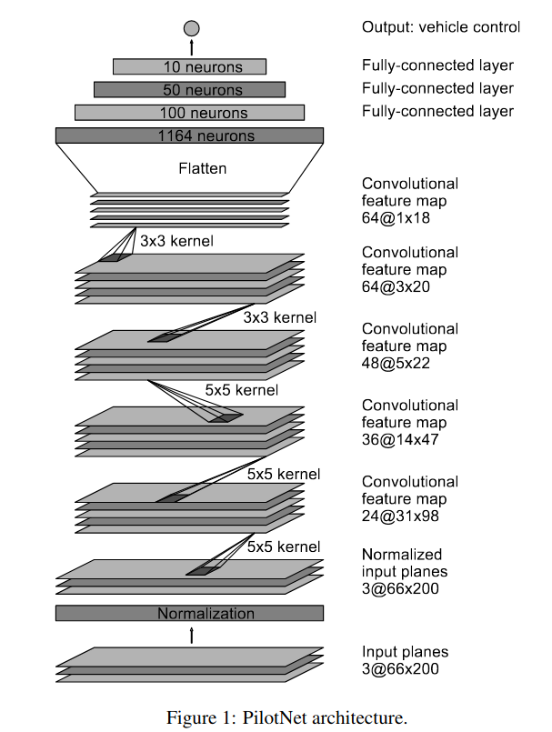

# Behavioral Cloning Project :oncoming_automobile:

Drive a car autonomously based on data of user's driving behavior. This project used Udacity's Self-driving Car Simulator as simulation environment. The CNN model created for this project is a modified version of the PilotNet, which was developed by Nvidia in 2017 for a similar task.

  
  

 
### CNN Architecture: PilotNet
|             Layers             |                       Description                       |
|:------------------------------:|:-------------------------------------------------------:|
|              Input             | 66x200 YUV image  (normalized with mean=0, std=1)       |
|      Convolution 5x5 ReLU      | 24 filters, 2x2 stride, valid padding, outputs 31x98x24 |
|      Convolution 5x5 ReLU      | 36 filters, 2x2 stride, valid padding, outputs 14x47x36 |
|      Convolution 5x5 ReLU      | 48 filters, 2x2 stride, valid padding, outputs 5x22x48  |
|      Convolution 3x3 ReLU      | 64 filters, 1x1 stride, valid padding, outputs 3x20x64  |
|      Convolution 3x3 ReLU      | 64 filters, 1x1 stride, valid padding, outputs 1x18x64  |
|             Flatten            | 1152                                                    |
|         Fully Connected        | input: 1152, output: 100                                |
|         Fully Connected        | input: 100, output: 50                                  |
|         Fully Connected        | input: 50, output: 10                                   |
| Fully Connected (Output Layer) | input: 10, output: 1                                    |

  
  
    
  PilotNet architecture as published in the original paper.

